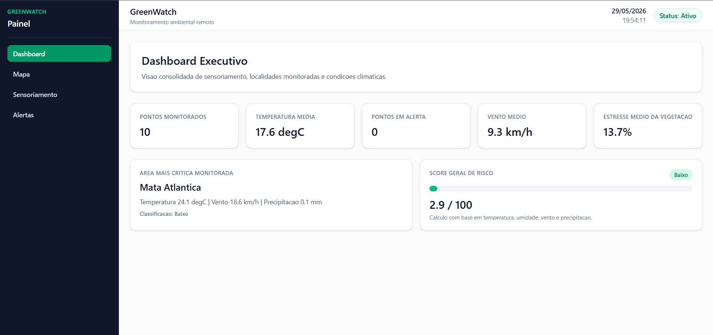
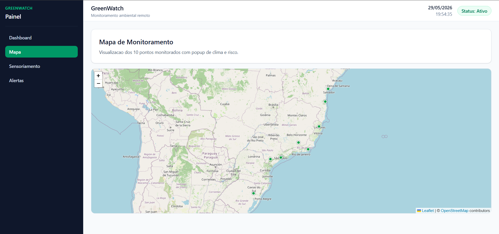
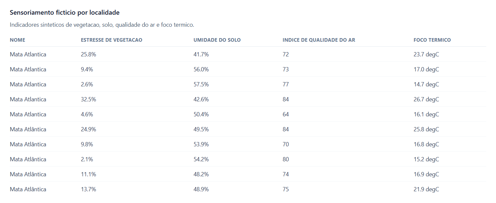
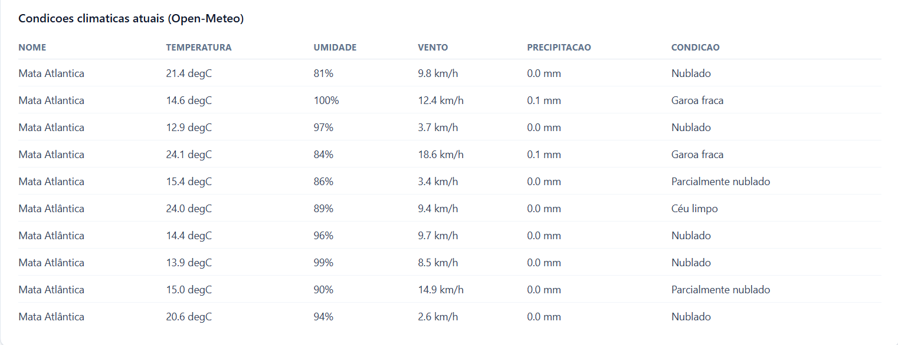
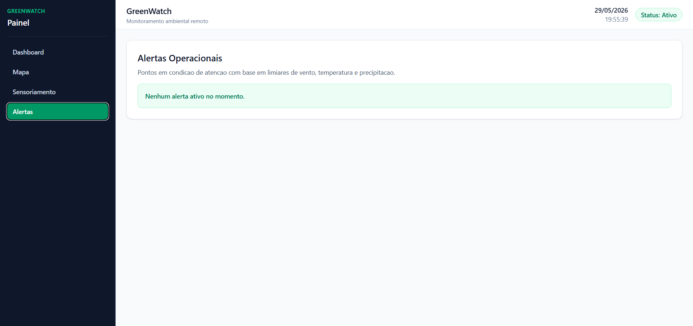

# Sprint02 - Application Development

## 1. Apresentacao

Este projeto implementa uma aplicacao web para monitoramento de localidades, com consolidacao de indicadores meteorologicos, exibicao geoespacial em mapa e classificacao de risco operacional. A solucao foi desenvolvida em TypeScript com React, adotando uma estrutura orientada a camadas para facilitar evolucao, manutencao e testes.

## 2. Objetivo

Fornecer uma base de monitoramento capaz de:

- consultar dados de localidades monitoradas;
- integrar dados climaticos em tempo quase real;
- calcular score de risco por localidade;
- apresentar visoes executivas em dashboard e mapa;
- apoiar tomada de decisao com indicadores sinteticos.

## 3. Escopo funcional

O sistema contempla:

- painel com metricas agregadas;
- mapa com marcadores de risco;
- pagina de monitoramento meteorologico por localidade;
- componentes visuais reutilizaveis para score e classificacao de risco.

## 4. Stack tecnologica

- React 19
- TypeScript
- Vite
- React Router
- TanStack Query
- Leaflet + React Leaflet
- Axios
- Tailwind CSS
- Vitest
- ESLint

## 5. Requisitos de ambiente

- Node.js 22 ou superior
- npm 10 ou superior

## 6. Configuracao e execucao

1. Instalar dependencias:

```bash
npm install
```

2. Configurar variaveis de ambiente:

```bash
cp .env.example .env
```

3. Executar ambiente de desenvolvimento:

```bash
npm run dev
```

## 7. Scripts disponiveis

- `npm run dev`: inicializa o servidor local de desenvolvimento.
- `npm run lint`: executa analise estatica de codigo com tolerancia zero para warnings.
- `npm run test`: executa os testes unitarios.
- `npm run test:watch`: executa testes em modo observacao.
- `npm run typecheck`: valida tipagem TypeScript sem emitir artefatos.
- `npm run build`: gera build de producao com validacao de tipos.
- `npm run preview`: publica localmente o build gerado.

## 8. Arquitetura da solucao

A organizacao segue principios de separacao de responsabilidades, com camadas explicitas:

- `src/domain`: entidades e contratos centrais do dominio.
- `src/application`: DTOs e mapeadores responsaveis por traducao de dados.
- `src/infrastructure`: clientes HTTP e servicos de integracao externa.
- `src/presentation`: paginas, componentes e hooks de interface.
- `src/shared`: utilitarios, configuracoes e constantes transversais.

Essa divisao reduz acoplamento entre regras de negocio, mecanismos de integracao e interface.

## 9. Fluxo de dados

1. A camada de apresentacao dispara consultas via hooks de query.
2. Servicos de infraestrutura consomem APIs externas.
3. Mapeadores convertem payloads externos para entidades internas.
4. Utilitarios de risco calculam score e nivel por localidade.
5. Componentes de UI apresentam indicadores consolidados e pontos criticos.

## 10. Qualidade e validacao

O projeto adota validacoes automatizadas em tres niveis:

- qualidade de codigo: `npm run lint`;
- confiabilidade funcional: `npm run test`;
- consistencia de build e tipagem: `npm run build`.

Atualmente, os testes unitarios cobrem logica de risco e mapeamento meteorologico, servindo como base para expansao de cobertura.

## 11. Decisoes tecnicas relevantes

- uso de React Query para gerenciamento de estado assincrono e cache;
- lazy loading de rotas para reduzir custo de carregamento inicial;
- modelagem explicita de entidades para melhorar legibilidade e manutencao;
- uso de TypeScript em toda a base para seguranca de tipos em tempo de desenvolvimento.

## 12. Estrutura de diretorios

```text
src/
  app/
  application/
  domain/
  infrastructure/
  presentation/
  shared/
tests/
  unit/
  integration/
  e2e/
```

## 13. Evolucao recomendada

Para continuidade do projeto, recomenda-se:

- ampliar testes de integracao dos servicos HTTP;
- incluir testes de interface para paginas criticas;
- formalizar pipeline CI com lint, testes e build em pull requests.

## 14. Video Pitch

- Link do video pitch (1 minuto): `https://SEU-LINK-AQUI`

## 15. Evidencias visuais (prints)

### Dashboard Executivo


### Mapa de Monitoramento


### Sensoriamento - Localidades


### Sensoriamento - Condicoes Climaticas


### Alertas Operacionais


## 16. Garantia de 10 localidades monitoradas

Para manter consistencia da apresentacao de sensoriamento:

- o sistema consulta o Nominatim com `limit=10`;
- se a API retornar menos pontos (ou falhar), um fallback fixo de 10 regioes reais e aplicado;
- o clima e consultado por coordenada para todos os pontos finais.

## 17. Checklist de entrega final

- Projeto zipado com codigo-fonte.
- Arquivo `integrantes.txt` no pacote final.
- Link do video pitch no README.
- (Opcional) Link do repositorio GitHub, se aceito pelo professor.

## 18. Aderencia aos criterios de avaliacao

- Desenvolvimento do Dashboard (3,0):
  - pagina inicial com KPIs de monitoramento, risco medio e area critica;
  - consolidacao de clima e sensoriamento ficticio na mesma visao executiva.
- Apresentacao do sensoriamento e localidades (3,0):
  - obtencao de 10 pontos geograficos via OpenStreetMap Nominatim;
  - fallback para garantir 10 localidades validas quando a API retornar menos pontos;
  - tabela de localidades com latitude/longitude e tabela de sensoriamento ficticio por ponto.
- Apresentacao das condicoes climaticas (2,0):
  - consulta por coordenada na Open-Meteo para cada localidade;
  - tabela dedicada com temperatura, umidade, vento, precipitacao e condicao.
- Video Pitch de 1 min (2,0):
  - secao de video pitch com link direto no README;
  - roteiro sugerido abaixo para garantir cobertura completa.

## 19. Roteiro de video pitch (60 segundos)

- 0s-10s: problema e objetivo do monitoramento remoto de areas de vegetacao.
- 10s-25s: dashboard executivo com KPIs principais e area critica.
- 25s-40s: pagina de sensoriamento com 10 localidades e coordenadas.
- 40s-52s: condicoes climaticas por ponto e mapa com risco.
- 52s-60s: conclusao com valor da solucao e proximos passos.
